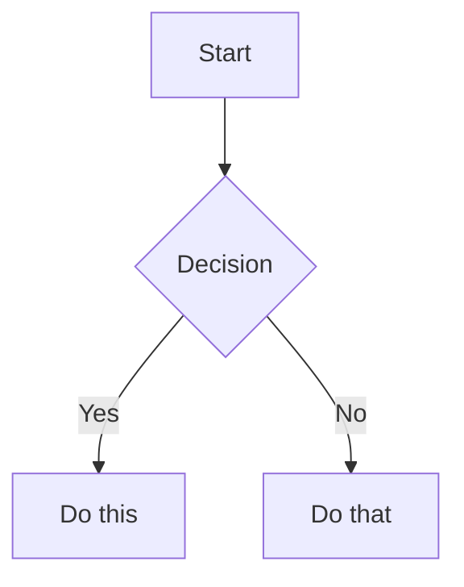

# Obsidian Flavored Markdown Skill

Create and edit valid Obsidian Flavored Markdown. Obsidian extends CommonMark and GFM with wikilinks, embeds, callouts, properties, comments, and other syntax.

## Workflow: Creating an Obsidian Note

1. Add frontmatter with properties (`title`, `tags`, `aliases`) at the top. See [PROPERTIES.md](references/PROPERTIES.md).
2. Write content using standard Markdown.
3. Link related notes with wikilinks (`[[Note]]`) for internal links.
4. Embed notes/files with `![[...]]` syntax. See [EMBEDS.md](references/EMBEDS.md).
5. Add callouts with `> [!type]` syntax. See [CALLOUTS.md](references/CALLOUTS.md).
6. Verify rendering in Obsidian reading view.

Use `[[wikilinks]]` for vault notes and `[text](url)` for external links.

## Internal Links (Wikilinks)

```markdown
[[Note Name]]
[[Note Name|Display Text]]
[[Note Name#Heading]]
[[Note Name#^block-id]]
[[#Heading in same note]]
```

Define a block ID by appending `^block-id`:

```markdown
This paragraph can be linked to. ^my-block-id
```

## Embeds

```markdown
![[Note Name]]
![[Note Name#Heading]]
![[image.png]]
![[image.png|300]]
![[document.pdf#page=3]]
```

## Callouts

```markdown
> [!note]
> Basic callout.

> [!warning] Custom Title
> Callout with custom title.

> [!faq]- Collapsed by default
> Foldable callout.
```

Common types: `note`, `tip`, `warning`, `info`, `example`, `quote`, `bug`, `danger`, `success`, `failure`, `question`, `abstract`, `todo`.

## Properties (Frontmatter)

```yaml
---
title: My Note
date: 2024-01-15
tags:
  - project
  - active
aliases:
  - Alternative Name
cssclasses:
  - custom-class
---
```

## Tags

```markdown
#tag
#nested/tag
```

## Comments

```markdown
This is visible %%but this is hidden%% text.

%%
This block is hidden in reading view.
%%
```

## Obsidian-Specific Formatting

```markdown
==Highlighted text==
```

## Math (LaTeX)

```markdown
Inline: $e^{i\pi} + 1 = 0$

$$
\frac{a}{b} = c
$$
```

## Diagrams (Mermaid)

````markdown

````

## Footnotes

```markdown
Text with a footnote[^1].

[^1]: Footnote content.

Inline footnote.^[This is inline.]
```

## References

Local references:
- [PROPERTIES.md](references/PROPERTIES.md)
- [EMBEDS.md](references/EMBEDS.md)
- [CALLOUTS.md](references/CALLOUTS.md)

Official docs:
- https://help.obsidian.md/obsidian-flavored-markdown
- https://help.obsidian.md/links
- https://help.obsidian.md/embeds
- https://help.obsidian.md/callouts
- https://help.obsidian.md/properties
